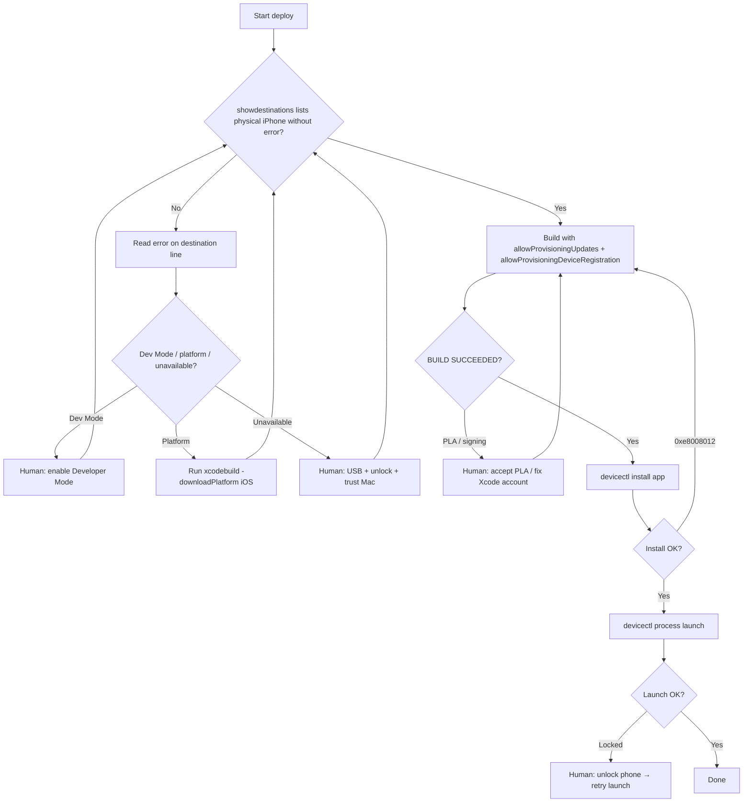

# iOS Device Deploy Guide (for AI Agents)

> **Entry point:** [`AGENTS.md`](../../AGENTS.md) at the repo root lists all agent docs.

This document records the end-to-end workflow used to build and install **Closed Captioner** on a physical iPhone. It is written for AI coding agents to reduce repeated troubleshooting in future sessions.

---

## Project context

| Item | Value |
|------|-------|
| Project type | Native iOS app (SwiftUI) |
| Xcode project | `ClosedCaptioner.xcodeproj` |
| Scheme | `ClosedCaptioner` |
| Bundle ID | `RaveSociety.ClosedCaptioner` |
| Display name | Closed Captioner |
| Development team | `66R936J3XS` (RaveSociety) |
| Min iOS | 16.4 |
| Signing | Automatic (`CODE_SIGN_STYLE = Automatic`) |
| Typical build output | `build/DerivedData/Build/Products/Debug-iphoneos/ClosedCaptioner.app` |

**Required permissions (runtime):** Microphone, Speech Recognition.

---

## Agent goals

1. Detect whether a physical iPhone is available for deployment.
2. Resolve common blockers **before** retrying the same failing command.
3. Build with correct signing flags so the device is registered and provisioned.
4. Install and launch the app on the phone.
5. Report remaining blockers that require **human action** clearly and once.

---

## Prerequisites (human + machine)

### On the Mac

- [ ] **Xcode** installed (`xcodebuild -version` succeeds).
- [ ] **Apple ID** added in **Xcode → Settings → Accounts** with a valid development team.
- [ ] **Valid code-signing identity** exists:
  ```bash
  security find-identity -v -p codesigning
  ```
  Expect at least one `Apple Development: ...` identity.
- [ ] **Apple Developer Program License Agreement** accepted at [developer.apple.com/account](https://developer.apple.com/account).  
  If not accepted, builds fail with:
  > `PLA Update available: You currently don't have access to this membership resource`

### On the iPhone

- [ ] Phone connected via **USB** (preferred) or reliable **Wi‑Fi debugging** (can be flaky).
- [ ] Phone **unlocked** during install and launch.
- [ ] **Trust This Computer** accepted if macOS prompts.
- [ ] **Developer Mode enabled**: Settings → Privacy & Security → Developer Mode → On → restart → confirm.
- [ ] First launch: if needed, trust developer cert: Settings → General → VPN & Device Management.

### iOS platform support (Xcode)

If the phone runs an iOS version newer than what Xcode has cached, install platform support:

```bash
xcodebuild -downloadPlatform iOS
```

This can take several minutes (~8+ GB for simulator/platform components). Do not assume failure until the command exits.

---

## Standard deployment workflow

Run from the repository root:

```bash
cd /path/to/ClosedCaptioner
```

### Step 1 — Discover devices

```bash
xcodebuild -showdestinations \
  -project ClosedCaptioner.xcodeproj \
  -scheme ClosedCaptioner
```

Look for a line like:

```
{ platform:iOS, arch:arm64, id:XXXXXXXX-..., name:Kai2 }
```

Also useful:

```bash
xcrun devicectl list devices
```

**Record:** device name, UDID (`id` from xcodebuild), and any `error:` suffix on the destination line.

#### Interpreting `devicectl` states

| State | Meaning | Agent action |
|-------|---------|--------------|
| `connected` | Ready | Proceed |
| `connected (no DDI)` | Missing Developer Disk Image / platform | Run `xcodebuild -downloadPlatform iOS` |
| `unavailable` | Not reachable (cable, lock, sleep, network) | Ask human to plug in USB, unlock, wake phone |
| `Developer Mode disabled` | Dev mode off | Ask human to enable Developer Mode |

### Step 2 — Build for the physical device

**Always use both provisioning flags** when deploying to a new or changed device:

```bash
DEVICE_ID="<udid-from-step-1>"

xcodebuild \
  -project ClosedCaptioner.xcodeproj \
  -scheme ClosedCaptioner \
  -destination "platform=iOS,id=${DEVICE_ID}" \
  -configuration Debug \
  -allowProvisioningUpdates \
  -allowProvisioningDeviceRegistration \
  -derivedDataPath build/DerivedData \
  build
```

#### Why both flags matter

| Flag | Purpose |
|------|---------|
| `-allowProvisioningUpdates` | Creates/updates profiles, App ID, certificates via Apple Developer portal |
| `-allowProvisioningDeviceRegistration` | **Registers the connected device** on the portal and includes it in the profile |

**Session lesson:** Building with only `-allowProvisioningUpdates` (or neither flag) produced a signed `.app` that **failed to install** with:

> `This provisioning profile cannot be installed on this device. (0xe8008012)`

Rebuild with `-allowProvisioningDeviceRegistration` after the device is connected.

### Step 3 — Install on device

```bash
APP="build/DerivedData/Build/Products/Debug-iphoneos/ClosedCaptioner.app"

xcrun devicectl device install app \
  --device "${DEVICE_ID}" \
  "${APP}"
```

### Step 4 — Launch on device

Phone must be **unlocked**:

```bash
xcrun devicectl device process launch \
  --device "${DEVICE_ID}" \
  RaveSociety.ClosedCaptioner
```

If launch fails with `Locked` / `device was not, or could not be, unlocked`, ask the human to unlock the phone and retry **only Step 4** (install already succeeded).

### Step 5 — Verify device details (optional diagnostics)

```bash
xcrun devicectl device info details --device "${DEVICE_ID}"
```

Confirm:

- `developerModeStatus: enabled`
- `ddiServicesAvailable: true`
- `bootState: booted`

---

## One-shot script (after prerequisites are met)

Replace `DEVICE_ID` with the UDID from Step 1.

```bash
DEVICE_ID="00008150-001468E1016A401C"   # example: Kai2

xcodebuild \
  -project ClosedCaptioner.xcodeproj \
  -scheme ClosedCaptioner \
  -destination "platform=iOS,id=${DEVICE_ID}" \
  -configuration Debug \
  -allowProvisioningUpdates \
  -allowProvisioningDeviceRegistration \
  -derivedDataPath build/DerivedData \
  build \
&& xcrun devicectl device install app \
  --device "${DEVICE_ID}" \
  build/DerivedData/Build/Products/Debug-iphoneos/ClosedCaptioner.app \
&& xcrun devicectl device process launch \
  --device "${DEVICE_ID}" \
  RaveSociety.ClosedCaptioner
```

---

## Troubleshooting matrix

Use this table to avoid retry loops. Match the error → apply the fix → change approach.

| Symptom / error | Root cause | Fix | Do **not** |
|-----------------|------------|-----|------------|
| `Developer Mode disabled` | Dev Mode off on iPhone | Human enables Developer Mode + restart | Retry build repeatedly without human action |
| `Timed out waiting for all destinations...` | Device not ready or Dev Mode off | Check destination line for `error:`; fix that first | Increase timeout only |
| `iOS 26.5 is not installed` / `no DDI` | Missing platform / DDI | `xcodebuild -downloadPlatform iOS` | Assume simulator download is unrelated — it fixes device support too |
| `PLA Update available` | License agreement not accepted | Human accepts agreement at developer.apple.com | Change bundle ID or signing randomly |
| `No profiles for 'RaveSociety.ClosedCaptioner'` | No provisioning profile yet | Build with `-allowProvisioningUpdates` | Commit secrets or disable signing |
| `Device "Kai2" isn't registered` | UDID not on developer portal | Rebuild with **both** `-allowProvisioningUpdates` and `-allowProvisioningDeviceRegistration` while device is connected | Reuse old `.app` from generic `iphoneos` build |
| `provisioning profile cannot be installed on this device (0xe8008012)` | Profile lacks this device | Same as above — rebuild with device registration flags | Only run `devicectl install` again |
| `CoreDeviceService was unable to locate a device` | Phone disconnected / asleep | USB + unlock + wake; re-run `devicectl list devices` | Use stale UDID from a previous session without verifying |
| `devicectl list` shows `unavailable` | Wireless pairing down or cable unplugged | Prefer USB; unlock phone | Wait indefinitely without asking human to connect |
| Install OK, launch `Locked` | Phone locked | Human unlocks; retry launch only | Rebuild entire app |
| `untrusted developer` on phone | Cert not trusted on device | Settings → General → VPN & Device Management → Trust | Re-sign with a different team without reason |
| Build for `generic/platform=iOS` succeeds but device install fails | Generic build may not include current device in profile | Always rebuild with explicit `-destination platform=iOS,id=...` and registration flags | Install generic-build artifact to a new phone |

---

## Decision flow (agent)



---

## Commands that failed in this session (and why)

| Command / approach | Result | Lesson |
|--------------------|--------|--------|
| `xcodebuild build` with device destination, no extra flags | Timeout / Dev Mode error | Fix device errors before building |
| `xcodebuild build` for `generic/platform=iOS` only | Build succeeded | **Insufficient** for new device install — profile may exclude device |
| `devicectl install` after generic build | `0xe8008012` profile error | Must rebuild with device registration |
| `xcodebuild build` with only `-allowProvisioningUpdates` | `Device isn't registered` | Must add `-allowProvisioningDeviceRegistration` |
| `devicectl process launch` while locked | `FBSOpenApplicationErrorDomain error 7` | Install can succeed; launch needs unlock |
| `xcrun devicectl list devices` early in session | Slow; CoreSimulator version warnings | Non-fatal noise; prefer `xcodebuild -showdestinations` for deploy readiness |

---

## Environment snapshot (reference session)

These values may change per machine/device; always re-discover, do not hardcode blindly.

| Item | Session value |
|------|----------------|
| Xcode | 26.5 (Build 17F42) |
| Target device name | Kai2 |
| Target device UDID | `00008150-001468E1016A401C` |
| Device model | iPhone 17 Pro Max (iPhone18,2) |
| Device iOS | 26.5 (23F77) |
| Signing identity | `Apple Development: karthikbibireddy@hotmail.com (AX345Z9632)` |
| Provisioning profile | `iOS Team Provisioning Profile: RaveSociety.ClosedCaptioner` |

---

## Agent checklist (minimal churn)

Before asking the human for help, verify:

1. [ ] `xcodebuild -showdestinations` shows the target iPhone **without** an `error:` field
2. [ ] `security find-identity -v -p codesigning` shows a valid Apple Development identity
3. [ ] Last build used **both** `-allowProvisioningUpdates` and `-allowProvisioningDeviceRegistration`
4. [ ] Build destination was `platform=iOS,id=<udid>` (not generic, not simulator)
5. [ ] Install used the `.app` from the **same** derived data path as that build
6. [ ] Phone was unlocked before launch
7. [ ] If install fails with `0xe8008012`, **rebuild** — do not retry install alone

### When to escalate to the human (once, clearly)

- Accept Apple Developer Program License Agreement
- Enable Developer Mode on iPhone
- Connect USB cable / unlock phone / tap Trust
- Trust developer certificate on device (Settings)
- Org-team permission issues (if device registration still fails after correct flags — may need Account Holder to register device)

---

## Related docs

| Doc | Path |
|-----|------|
| Agent index | [`AGENTS.md`](../../AGENTS.md) |
| Project overview | [`README.md`](../../README.md) |
| Privacy policy | [`PrivacyPolicy.md`](../../PrivacyPolicy.md) |

---

## Maintenance

Update this file when:

- Bundle ID or team ID changes
- Deployment target or Xcode version requirements change
- A new class of deploy error is encountered and resolved
- Default derived data or output paths change

After edits, ensure [`AGENTS.md`](../../AGENTS.md) still links to this file.
