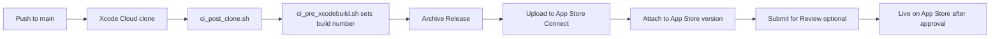

# Xcode Cloud — App Store Release Workflow

> **Entry point:** [`AGENTS.md`](../../AGENTS.md)

This guide sets up **Xcode Cloud** to archive **Closed Captioner** on push to `main` and upload directly to **App Store Connect** for App Store review — **no TestFlight**.

---

## What is already in the repo

| Path | Purpose |
|------|---------|
| `ci_scripts/ci_post_clone.sh` | Runs after git clone (no extra deps for this project) |
| `ci_scripts/ci_pre_xcodebuild.sh` | Sets `CFBundleVersion` from `CI_BUILD_NUMBER` (required for repeat uploads) |
| `ClosedCaptioner.xcodeproj/xcshareddata/xcschemes/ClosedCaptioner.xcscheme` | **Shared scheme** — required for Xcode Cloud |

---

## Cost

| Item | Cost |
|------|------|
| Apple Developer Program | **$99/year** (required) |
| Xcode Cloud | **25 compute hours/month free**, then paid tiers if exceeded |
| App Store submission | **$0** per version |

For a solo app with releases a few times per month, you will likely stay within the free tier.

---

## Prerequisites (one-time, human)

Complete these **before** creating the workflow in Xcode.

### 1. App Store Connect app record

- [ ] Sign in to [App Store Connect](https://appstoreconnect.apple.com)
- [ ] Create app (if missing):
  - **Name:** Closed Captioner
  - **Bundle ID:** `RaveSociety.ClosedCaptioner`
  - **SKU:** e.g. `closed-captioner-001`

### 2. Store listing basics (needed before App Store review)

- [ ] Host [`PrivacyPolicy.md`](../../PrivacyPolicy.md) at a **public URL**
- [ ] Prepare screenshots, description, keywords, support URL
- [ ] Complete **App Privacy** questionnaire to match [`PrivacyPolicy.md`](../../PrivacyPolicy.md) §20: Audio Data (no tracking); Device ID + Advertising Data (**Used for Tracking** = Yes via AdMob/ATT)

### 3. GitHub repository access

- [ ] Repo pushed to GitHub: `https://github.com/kbibireddy/closed-captioner.git`
- [ ] Branch for releases: `main`
- [ ] Commit and push the Xcode Cloud files (`ci_scripts/`, shared scheme)

### 4. Apple Developer account

- [ ] Program License Agreement accepted
- [ ] Team **RaveSociety** (`66R936J3XS`) has App Store Connect access

---

## One-time setup in Xcode (create the workflow)

These steps are done in the **Xcode UI** — they cannot be fully defined in git.

### Step 1 — Open project and start Xcode Cloud

> **Note:** In Xcode 15+ (including Xcode 26), **Product → Xcode Cloud** may not appear. Use the **Report navigator** path below instead.

1. Open `ClosedCaptioner.xcodeproj` in Xcode on your Mac.
2. In the **left sidebar**, click the **Report navigator** (rightmost tab — icon looks like a speech bubble / lines).
3. At the top of that panel, select the **Cloud** tab.
4. Click **Get Started** or **Create Workflow**.
5. Sign in with the Apple ID tied to team **RaveSociety**.
6. When prompted, **grant Xcode Cloud access** to the GitHub repo `kbibireddy/closed-captioner`.

**Alternative paths if Cloud tab is empty:**

- **Report navigator → Cloud →** `+` button (bottom-left) → **Create Workflow**
- [App Store Connect](https://appstoreconnect.apple.com) → your app → **Xcode Cloud** tab → **Manage Workflows** (editing only — **first workflow must be created in Xcode**)

If GitHub is not connected:

- Xcode → **Settings → Accounts →** your Apple ID → **Manage Certificates…** / cloud settings
- Or App Store Connect → **Users and Access → Integrations → Xcode Cloud**

### Step 2 — Configure the workflow

Use these recommended settings:

| Setting | Value |
|---------|-------|
| **Name** | `App Store Release` |
| **Repository** | `kbibireddy/closed-captioner` |
| **Project/Workspace** | `ClosedCaptioner.xcodeproj` |
| **Primary branch** | `main` |

#### Start condition

| Setting | Value |
|---------|-------|
| **Trigger** | On push to `main` |
| **Files and folders** (optional) | Leave empty to build on any push, or limit to `ClosedCaptioner/**` to skip doc-only changes |

#### Environment

| Setting | Value |
|---------|-------|
| **Xcode version** | Latest Release (or match local, e.g. 26.x) |
| **macOS version** | Default |

#### Actions

| Action | Setting |
|--------|---------|
| **Archive** | Scheme: `ClosedCaptioner`, Platform: iOS, Configuration: **Release** |

#### Post-actions (direct App Store — no TestFlight)

Use **one** post-action only:

| Post-action | Setting | Result |
|-------------|---------|--------|
| **App Store Connect** | **Prepare for Submission** | Uploads build and attaches it to the matching App Store version; you submit for review in ASC (or it waits until metadata is complete) |
| **App Store Connect** | **Submit for Review** | Fully automatic — submits to App Review when the App Store version metadata is complete |

**Do not add** TestFlight Internal or External Testing post-actions if you want to skip TestFlight entirely.

**Recommendation:** Start with **Prepare for Submission** until your first App Store version is fully configured. Switch to **Submit for Review** once screenshots, privacy URL, and App Privacy are done.

**Requirements for automatic App Store pickup:**

1. An **App Store version** must exist in ASC with the same **marketing version** as Xcode (e.g. `1.1` in both places)
2. Store listing metadata must be complete (for **Submit for Review**)
3. **App Store Version Release** set to **Automatically release this version** (already configured on v1.0)
4. `ITSAppUsesNonExemptEncryption = false` in `Info.plist` (already in repo — avoids export compliance blocking)

### Step 3 — Signing

Xcode Cloud manages **distribution certificates** and **App Store provisioning profiles** for you when:

- Automatic signing is enabled (already set in the project)
- Team `66R936J3XS` is selected
- The bundle ID exists in the developer portal / App Store Connect

On first workflow run, approve any certificate/profile creation prompts in Xcode or App Store Connect.

### Step 4 — Commit workflow (optional)

Xcode may offer to commit the workflow definition. If prompted, allow it so workflow metadata is tracked in git.

### Step 5 — Run first build

1. **Report navigator → Cloud** tab
2. Select **App Store Release** → **Start Build** (manual first run is fine)
3. Or push a commit to `main` to trigger automatically

Monitor builds at [App Store Connect → Xcode Cloud](https://appstoreconnect.apple.com) or in Xcode’s Report navigator → **Cloud** tab.

---

## What happens on each push to `main`

1. GitHub webhook triggers Xcode Cloud
2. `ci_post_clone.sh` runs
3. `ci_pre_xcodebuild.sh` sets build number to `CI_BUILD_NUMBER`
4. Xcode archives **Release** build
5. Build uploads to App Store Connect
6. Post-action attaches build to the App Store version (same marketing version)
7. If post-action is **Submit for Review** and metadata is complete → goes to App Review automatically
8. After approval → goes live (if auto-release is enabled)

**TestFlight is not used.** Builds go straight to the App Store pipeline.

---

## After a successful upload

In [App Store Connect](https://appstoreconnect.apple.com):

1. Open **Closed Captioner** → **Distribution** (not TestFlight)
2. Confirm the new build appears under the correct version (e.g. **1.1**)
3. If using **Prepare for Submission**, click **Submit for Review** when ready
4. Wait for App Review (typically 24–48 hours)
5. App goes live automatically (auto-release is already enabled on v1.0)

---

## Edit an existing workflow (remove TestFlight)

If your workflow already has TestFlight post-actions:

1. Xcode → **Report navigator → Cloud** tab
2. Control-click workflow **App Store Release** → **Manage Workflows**
3. Open the workflow → **Post-Actions**
4. **Remove** any **TestFlight Internal Testing** or **TestFlight External Testing** actions
5. Ensure **App Store Connect** post-action is present:
   - **Prepare for Submission** (semi-auto), or
   - **Submit for Review** (fully auto when metadata complete)
6. Save

Or in App Store Connect → **Xcode Cloud** → **Manage Workflows** → edit the same settings.

---

## Troubleshooting

| Symptom | Likely cause | Fix |
|---------|--------------|-----|
| No **Product → Xcode Cloud** menu | Removed/moved in Xcode 15+ | Use **Report navigator → Cloud → Get Started** |
| **Cloud** tab missing or greyed out | Not signed into Apple ID, or no eligible team | Xcode → **Settings → Accounts** → add Apple ID with team **RaveSociety** |
| Workflow not offered in Xcode | No shared scheme / not pushed | Ensure `xcshareddata/xcschemes/ClosedCaptioner.xcscheme` is committed |
| GitHub access denied | Xcode Cloud not authorized | Re-link GitHub in ASC Integrations or Xcode Accounts |
| Duplicate build number | `ci_pre_xcodebuild.sh` not running | Confirm `ci_scripts/` is at repo root; scripts are executable |
| Signing failed | Bundle ID / team mismatch | Verify `RaveSociety.ClosedCaptioner` and team `66R936J3XS` |
| Build succeeds, build not on App Store version | Wrong post-action or version mismatch | Remove TestFlight actions; add **App Store Connect** post-action; ensure ASC version matches `MARKETING_VERSION` |
| Build stuck on export compliance | Encryption prompt | `ITSAppUsesNonExemptEncryption = false` in Info.plist (done); clear Build 7 once in ASC |
| App Store submit blocked | Incomplete listing | Add screenshots, privacy URL, App Privacy answers |
| Archive fails on speech/mic APIs | Missing usage descriptions | Already set in project — do not remove `INFOPLIST_KEY_NSMicrophoneUsageDescription` / `NSSpeechRecognitionUsageDescription` |

---

## Versioning rules

| Field | Where | Rule |
|-------|-------|------|
| **Marketing version** (e.g. `1.0`) | `MARKETING_VERSION` in Xcode | Bump manually for feature releases |
| **Build number** | Set by `ci_pre_xcodebuild.sh` | Auto-incremented per Xcode Cloud build via `CI_BUILD_NUMBER` |

Before a major release, bump `MARKETING_VERSION` in `ClosedCaptioner.xcodeproj` and commit to `main`.

---

## Related docs

| Doc | Path |
|-----|------|
| Agent index | [`AGENTS.md`](../../AGENTS.md) |
| Local device deploy | [`device-deploy.md`](device-deploy.md) |
| Privacy policy text | [`PrivacyPolicy.md`](../../PrivacyPolicy.md) |
