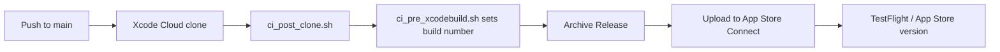

# Xcode Cloud — App Store Release Workflow

> **Entry point:** [`AGENTS.md`](../../AGENTS.md)

This guide sets up **Xcode Cloud** to archive **Closed Captioner** on push to `main` and deliver builds to **App Store Connect** for TestFlight and App Store review.

---

## What is already in the repo

| Path | Purpose |
|------|---------|
| `ci_scripts/ci_post_clone.sh` | Runs after git clone (no extra deps for this project) |
| `ci_scripts/ci_pre_xcodebuild.sh` | Sets `CFBundleVersion` from `CI_BUILD_NUMBER` (required for repeat uploads) |
| `ClosedCaptioner.xcodeproj/xcshareddata/xcschemes/ClosedCaptioner.xcscheme` | **Shared scheme** — required for Xcode Cloud |

---

## Cost

| Item | Cost |
|------|------|
| Apple Developer Program | **$99/year** (required) |
| Xcode Cloud | **25 compute hours/month free**, then paid tiers if exceeded |
| App Store submission | **$0** per version |

For a solo app with releases a few times per month, you will likely stay within the free tier.

---

## Prerequisites (one-time, human)

Complete these **before** creating the workflow in Xcode.

### 1. App Store Connect app record

- [ ] Sign in to [App Store Connect](https://appstoreconnect.apple.com)
- [ ] Create app (if missing):
  - **Name:** Closed Captioner
  - **Bundle ID:** `RaveSociety.ClosedCaptioner`
  - **SKU:** e.g. `closed-captioner-001`

### 2. Store listing basics (needed before App Store review)

- [ ] Host [`PrivacyPolicy.md`](../../PrivacyPolicy.md) at a **public URL**
- [ ] Prepare screenshots, description, keywords, support URL
- [ ] Complete **App Privacy** questionnaire (microphone, on-device speech, local storage)

### 3. GitHub repository access

- [ ] Repo pushed to GitHub: `https://github.com/kbibireddy/closed-captioner.git`
- [ ] Branch for releases: `main`
- [ ] Commit and push the Xcode Cloud files (`ci_scripts/`, shared scheme)

### 4. Apple Developer account

- [ ] Program License Agreement accepted
- [ ] Team **RaveSociety** (`66R936J3XS`) has App Store Connect access

---

## One-time setup in Xcode (create the workflow)

These steps are done in the **Xcode UI** — they cannot be fully defined in git.

### Step 1 — Open project and start Xcode Cloud

> **Note:** In Xcode 15+ (including Xcode 26), **Product → Xcode Cloud** may not appear. Use the **Report navigator** path below instead.

1. Open `ClosedCaptioner.xcodeproj` in Xcode on your Mac.
2. In the **left sidebar**, click the **Report navigator** (rightmost tab — icon looks like a speech bubble / lines).
3. At the top of that panel, select the **Cloud** tab.
4. Click **Get Started** or **Create Workflow**.
5. Sign in with the Apple ID tied to team **RaveSociety**.
6. When prompted, **grant Xcode Cloud access** to the GitHub repo `kbibireddy/closed-captioner`.

**Alternative paths if Cloud tab is empty:**

- **Report navigator → Cloud →** `+` button (bottom-left) → **Create Workflow**
- [App Store Connect](https://appstoreconnect.apple.com) → your app → **Xcode Cloud** tab → **Manage Workflows** (editing only — **first workflow must be created in Xcode**)

If GitHub is not connected:

- Xcode → **Settings → Accounts →** your Apple ID → **Manage Certificates…** / cloud settings
- Or App Store Connect → **Users and Access → Integrations → Xcode Cloud**

### Step 2 — Configure the workflow

Use these recommended settings:

| Setting | Value |
|---------|-------|
| **Name** | `App Store Release` |
| **Repository** | `kbibireddy/closed-captioner` |
| **Project/Workspace** | `ClosedCaptioner.xcodeproj` |
| **Primary branch** | `main` |

#### Start condition

| Setting | Value |
|---------|-------|
| **Trigger** | On push to `main` |
| **Files and folders** (optional) | Leave empty to build on any push, or limit to `ClosedCaptioner/**` to skip doc-only changes |

#### Environment

| Setting | Value |
|---------|-------|
| **Xcode version** | Latest Release (or match local, e.g. 26.x) |
| **macOS version** | Default |

#### Actions

| Action | Setting |
|--------|---------|
| **Archive** | Scheme: `ClosedCaptioner`, Platform: iOS, Configuration: **Release** |

#### Post-actions (App Store path)

Add **both** for a safe first release, then you can simplify:

1. **TestFlight Internal Testing** (optional but recommended for first build)
   - Automatically distributes to internal testers on your team

2. **App Store Connect** → **Prepare for Submission** or **Submit for Review**
   - **Prepare for Submission:** uploads build; you finish metadata and submit manually in ASC
   - **Submit for Review:** auto-submits when metadata is complete (stricter)

**Recommendation for v1.0:** use **TestFlight Internal** first. After verifying the build, add **Prepare for Submission** or submit manually in App Store Connect.

### Step 3 — Signing

Xcode Cloud manages **distribution certificates** and **App Store provisioning profiles** for you when:

- Automatic signing is enabled (already set in the project)
- Team `66R936J3XS` is selected
- The bundle ID exists in the developer portal / App Store Connect

On first workflow run, approve any certificate/profile creation prompts in Xcode or App Store Connect.

### Step 4 — Commit workflow (optional)

Xcode may offer to commit the workflow definition. If prompted, allow it so workflow metadata is tracked in git.

### Step 5 — Run first build

1. **Report navigator → Cloud** tab
2. Select **App Store Release** → **Start Build** (manual first run is fine)
3. Or push a commit to `main` to trigger automatically

Monitor builds at [App Store Connect → Xcode Cloud](https://appstoreconnect.apple.com) or in Xcode’s Report navigator → **Cloud** tab.

---

## What happens on each push to `main`

1. GitHub webhook triggers Xcode Cloud
2. `ci_post_clone.sh` runs
3. `ci_pre_xcodebuild.sh` sets build number to `CI_BUILD_NUMBER`
4. Xcode archives **Release** build
5. Build uploads to App Store Connect
6. Post-action distributes to TestFlight and/or prepares App Store version

**Pushing code does not instantly publish to the App Store.** It uploads a build. You still need complete store metadata and (for first release) **Submit for Review** in App Store Connect unless the workflow post-action is set to auto-submit.

---

## After a successful upload

In [App Store Connect](https://appstoreconnect.apple.com):

1. Open **Closed Captioner** → **TestFlight** — confirm build processing finished (can take 5–30 min)
2. Install via TestFlight on your phone and smoke-test
3. Open **App Store** tab → version **1.0**
4. Attach the new build, fill metadata, submit for review

---

## Troubleshooting

| Symptom | Likely cause | Fix |
|---------|--------------|-----|
| No **Product → Xcode Cloud** menu | Removed/moved in Xcode 15+ | Use **Report navigator → Cloud → Get Started** |
| **Cloud** tab missing or greyed out | Not signed into Apple ID, or no eligible team | Xcode → **Settings → Accounts** → add Apple ID with team **RaveSociety** |
| Workflow not offered in Xcode | No shared scheme / not pushed | Ensure `xcshareddata/xcschemes/ClosedCaptioner.xcscheme` is committed |
| GitHub access denied | Xcode Cloud not authorized | Re-link GitHub in ASC Integrations or Xcode Accounts |
| Duplicate build number | `ci_pre_xcodebuild.sh` not running | Confirm `ci_scripts/` is at repo root; scripts are executable |
| Signing failed | Bundle ID / team mismatch | Verify `RaveSociety.ClosedCaptioner` and team `66R936J3XS` |
| Build succeeds, no TestFlight build | Post-action missing | Add TestFlight or App Store Connect post-action to workflow |
| App Store submit blocked | Incomplete listing | Add screenshots, privacy URL, App Privacy answers |
| Archive fails on speech/mic APIs | Missing usage descriptions | Already set in project — do not remove `INFOPLIST_KEY_NSMicrophoneUsageDescription` / `NSSpeechRecognitionUsageDescription` |

---

## Versioning rules

| Field | Where | Rule |
|-------|-------|------|
| **Marketing version** (e.g. `1.0`) | `MARKETING_VERSION` in Xcode | Bump manually for feature releases |
| **Build number** | Set by `ci_pre_xcodebuild.sh` | Auto-incremented per Xcode Cloud build via `CI_BUILD_NUMBER` |

Before a major release, bump `MARKETING_VERSION` in `ClosedCaptioner.xcodeproj` and commit to `main`.

---

## Related docs

| Doc | Path |
|-----|------|
| Agent index | [`AGENTS.md`](../../AGENTS.md) |
| Local device deploy | [`device-deploy.md`](device-deploy.md) |
| Privacy policy text | [`PrivacyPolicy.md`](../../PrivacyPolicy.md) |
